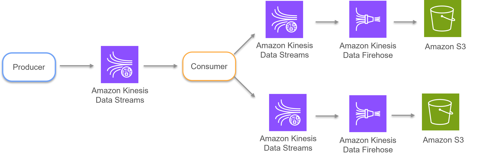

# Kinesis Streaming Pipeline

A real-time data streaming pipeline built on AWS Kinesis that ingests user session events, enriches and routes them by country, and delivers the processed data to S3 for downstream analytics.

## Architecture




```
Producer → Kinesis Data Stream (source) → Consumer (transform) → Kinesis Data Streams (USA / International) → Kinesis Firehose → S3
```

1. **Producer** publishes user session records (browsing history, cart activity) to a source Kinesis stream.
2. **Consumer** polls the source stream, enriches each record (adds processing timestamp, aggregates product quantities, cart totals), and routes it to a country-specific destination stream (USA or International).
3. **Kinesis Firehose** reads from each destination stream and delivers batched records to their respective S3 buckets.

## Project Structure

```
.
├── cli/
│   ├── producer_from_cli.py     # Standalone producer for manual testing
│   ├── consumer_from_cli.py     # Standalone consumer for manual testing
│   └── record.json              # Sample session record for testing
├── etl/
│   ├── consumer.py               # Main consumer with transform + routing logic
│   └── dest_streams.json         # Destination stream name mapping
├── terraform/
│   ├── provider.tf                # AWS provider configuration
│   ├── main.tf                    # S3 bucket definitions
│   └── outputs.tf                 # Output values (bucket names, ARNs)
└── Streaming_Ingestion.ipynb      # Notebook used for building/testing Firehose + IAM setup
```

## Prerequisites

- Python 3.x
- `boto3`
- AWS CLI configured with credentials (`aws configure`)
- Terraform (for infrastructure provisioning)

## Setup

1. Provision the S3 buckets:
   ```bash
   cd terraform
   terraform init
   terraform apply
   ```

2. Create the Kinesis data streams (source + two destination streams).

3. Create the Firehose delivery streams and IAM roles connecting each destination stream to its S3 bucket.

## Running the Pipeline

**Start the consumer** (in its own terminal):
```bash
python etl/consumer.py --source_stream kinesis-data-stream-cli --dest_streams_file etl/dest_streams.json
```

**Send a test record** (in a separate terminal):
```bash
python cli/producer_from_cli.py --stream kinesis-project-usa-563649768086-data-stream --json_file cli/record.json
```

Processed records will appear in the destination Kinesis streams, then flow to S3 via Firehose (subject to buffering interval)
_
